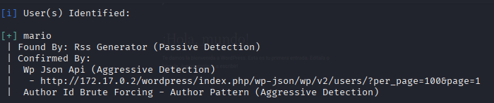
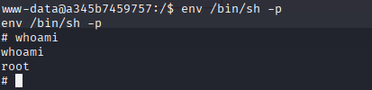

# Lab de Pentesting: Escalada de privilegios en máquina WalkingCMS

Este repositorio documenta el proceso paso a paso para comprometer y escalar privilegios en la máquina objetivo con IP `172.17.0.2`.

## Resumen

El objetivo principal fue identificar servicios activos, realizar enumeración, obtener acceso mediante fuerza bruta a WordPress y finalmente escalar privilegios para obtener control total del sistema.

## Herramientas utilizadas

- `ping`  
- `nmap`   
- `wpscan`  
- `netcat`   
- `find`  
- `script`, `stty` (para manejo TTY)  
- Referencia: GTFOBins  

## Pasos realizados

### 1. Verificar conectividad con ping

    ping -c 4 172.17.0.2

Se confirmó que el objetivo responde a la red.

### 2. Escaneo de puertos

Se detectó un servicio HTTP en el puerto 80 corriendo Apache httpd 2.4.57 (Debian).

### 3. Acceso al sitio web

Se visitó la IP [http://172.17.0.2](http://172.17.0.2) en el navegador para inspeccionar contenido.

### 4. Enumeración de directorios

Se realizó búsqueda de directorios y se encontró un WordPress en `/wordpress`.

### 5. Acceso a login de WordPress

Se accedió a [http://172.17.0.2/wordpress/wp-admin](http://172.17.0.2/wordpress/wp-admin), donde apareció la pantalla de login.

### 6. Enumeración de usuarios con WPSCAN

    wpscan --url http://172.17.0.2/wordpress --enumerate u

Se enumeró el usuario `mario`.

### 7. Obtención de contraseña

    wpscan --url http://172.17.0.2/wordpress -U mario -P /usr/share/wordlists/metasploit/unix_passwords.txt 

Se logró obtener la contraseña `love` para el usuario `mario` .

### 8. Acceso al panel WordPress

Con las credenciales `mario:love`, se accedió al panel administrativo.

### 9. Edición de tema vulnerable

Se encontró un tema desactualizado con editor habilitado para modificar archivos PHP.

### 10. Inserción de reverse shell

Se reemplazó el código del archivo `index.php` del tema por un reverse shell PHP (pentestmonkey), configurando IP y puerto del atacante.

### 11. Escucha en máquina atacante

Se usó netcat para escuchar en el puerto configurado.

### 12. Activación de reverse shell

Se visitó la URL del tema modificado para activar la conexión inversa y obtener shell remota.

### 13. Escalada de privilegios

El comando `sudo -l` no funcionó, pero `find` sí.  
Se identificaron binarios con permiso SUID, especialmente `/usr/bin/env`.

### 14. Tratamiento de TTY para shell interactiva

    script /dev/null -c bash
    # Luego presionar Ctrl+Z y ejecutar:
    stty raw -echo; fg
    reset
    export TERM=xterm
    export SHELL=bash

### 15. Escalada mediante SUID y GTFOBins

Usando `/usr/bin/env` con permisos SUID, y referencias de GTFOBins:

    /env /bin/sh -p

Se obtuvo acceso root completo.

## Resultados finales

- Acceso a WordPress con credenciales obtenidas.  
- Ejecución de reverse shell PHP para acceso remoto.  
- Escalada de privilegios root usando binario con permisos SUID y técnicas GTFOBins.  
- Control total y persistente sobre la máquina.

---

> **Nota:** Este repositorio es para fines educativos y de práctica en pentesting ético. No debe usarse en sistemas sin autorización expresa.
